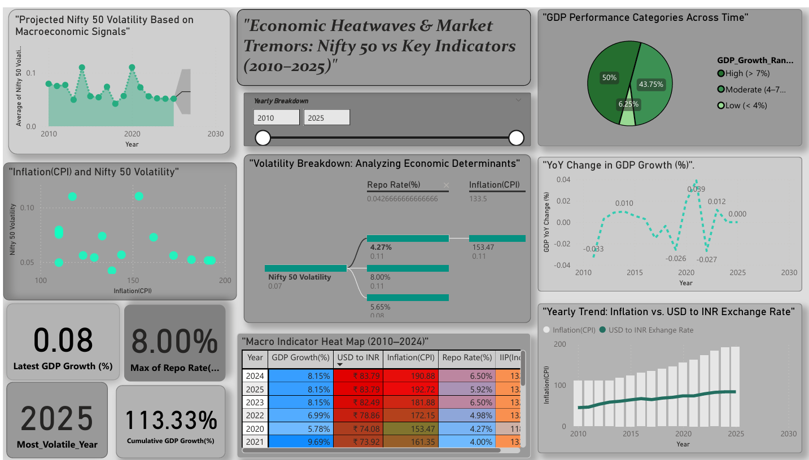

# 📈 Nifty 50 Volatility & Macroeconomic Indicators Dashboard

## 📘 Overview

This project explores how key macroeconomic indicators influence the **volatility of the Nifty 50 index**—India's benchmark stock market index. Using data analytics, regression modeling, and visualization tools, we’ve created an **interactive Power BI dashboard** that captures trends, relationships, and patterns in the Indian economy between **2010 and 2025**.

---

## 🧩 Macroeconomic Indicators Used

The following indicators were analyzed:

- **Nifty 50 Volatility** (monthly standard deviation)
- **Consumer Price Index (CPI)** – proxy for Inflation
- **RBI Repo Rate**
- **Index of Industrial Production (IIP)**
- **USD to INR Exchange Rate**
- **Real GDP Growth Rate (%)**

---

## 🗂️ Data Sources

| Indicator         | Source                                                 |
|------------------|--------------------------------------------------------|
| Nifty 50 Volatility | [NSE India](https://www.nseindia.com)                |
| CPI               | [MOSPI](https://mospi.gov.in)                          |
| RBI Repo Rate     | [RBI Database](https://dbie.rbi.org.in)               |
| IIP               | [MOSPI](https://mospi.gov.in)                          |
| USD to INR Rate   | [Yahoo Finance](https://finance.yahoo.com/quote/INR=X)|
| GDP Growth        | [MOSPI](https://mospi.gov.in)                          |

---

## 🐍 Data Preparation (Python)

The dataset was built using **Python (Pandas, NumPy, Seaborn, Matplotlib)**.

- Cleaned and merged 6+ datasets using `merge` and `outer join`.
- Converted string percentages and date fields to numerical formats.
- Created summary metrics and derived fields (e.g., YoY change).
- Handled missing data using imputation and domain logic.
- Performed linear regression to test how indicators affect Nifty volatility.

➡️ Exported final dataset as `nifty_macro_dataset.csv` and loaded into Power BI.

---

## 📊 Power BI Dashboard



The Power BI dashboard is designed to be clean, intuitive, and analytically rich.

### 🔍 Key Visuals:

#### ✅ KPIs
- **Latest GDP Growth (%)**
- **Max Repo Rate (%)**
- **Most Volatile Year**
- **Cumulative GDP Growth**

#### 📉 Forecasting
- **Nifty 50 Volatility Forecast** based on past trends and macro indicators.

#### 🧠 Correlation Analysis
- Scatter plot between **Inflation and Nifty 50 Volatility**
- Decomposition Tree breaking down volatility by **GDP Bins**, **CPI**, and **Repo Rate**

#### 🌡️ Macro Heat Map (2010–2025)
- Conditional formatting applied to show **intensity of macro shocks** over time.

#### 📈 Dual Axis Chart
- Track **Inflation vs USD to INR** on a yearly basis.

#### 🧩 Interactive Elements
- **Slicers**:
  - Year (Horizontal)
  - GDP Growth Ranges (Bins)
- All visuals are connected via **interactive slicers** for dynamic filtering.

#### 📊 Pie Chart: GDP Performance Categories
- Proportion of years with **high**, **moderate**, and **low** GDP growth rates.

---

## ⚙️ Technologies Used

- **Python** (Pandas, NumPy, Seaborn, Matplotlib, yfinance)
- **Power BI** (Desktop)
- **GitHub** (Repository, Version Control)

---

## 🚀 How to Use

1. Clone this repository or download the `nifty_macro_dashboard.pbix` file.
2. Open it in Power BI Desktop.
3. Use the **Year Slicer** to explore trends over time.
4. Hover over visuals and charts to reveal deep insights.

---

## 📁 Repository Structure

```
📁 Nifty50-Macro-Dashboard/
├── 📁 data/                             # Folder containing raw macroeconomic data files (CSV/Excel)
│   └── [GDP.csv, Inflation.xlsx, etc.] # Individual data files uploaded by you
│
├── NIFTY 50 Dashboard.pbix             # Final Power BI dashboard file
│
├── dashboard.png                       # Screenshot preview of the dashboard
│
├── macro_dashboard_analysis.ipynb      # Jupyter notebook used for data preparation and cleaning
│
├── README.md                           # Documentation explaining the entire project

```


## 🌟 Acknowledgments

Special thanks to:
- [RBI](https://rbi.org.in)
- [MOSPI](https://mospi.gov.in)
- [Yahoo Finance](https://finance.yahoo.com)
- [NSE India](https://www.nseindia.com)

---


